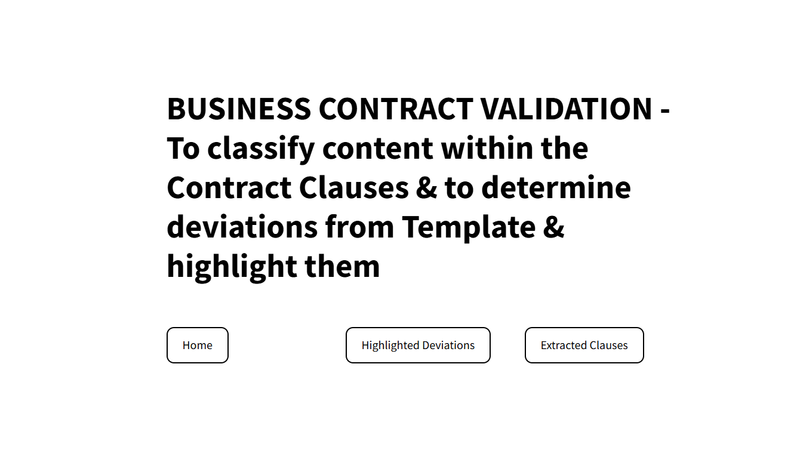
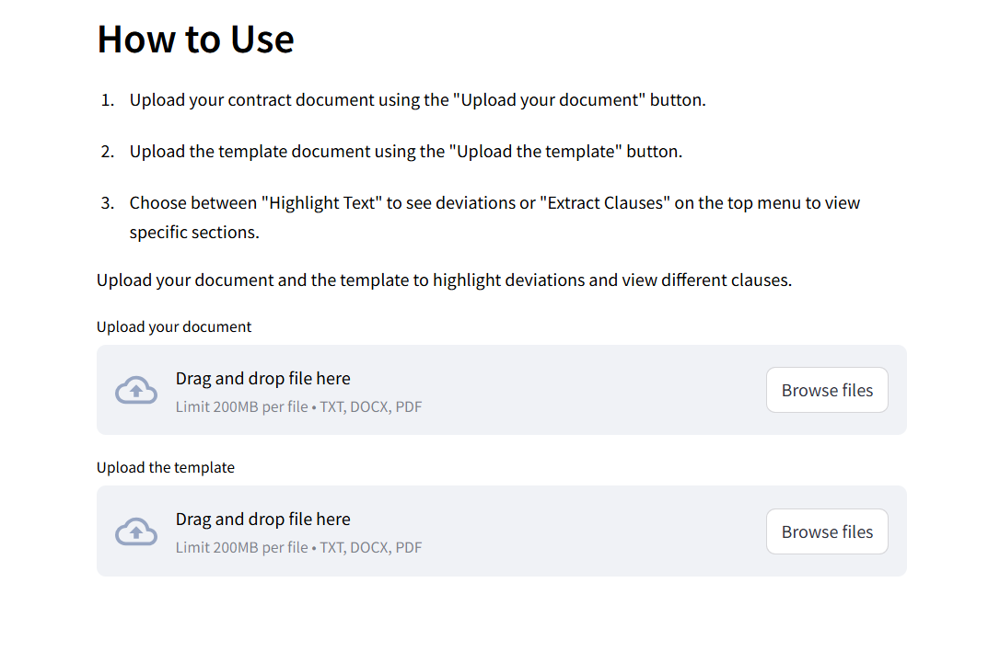
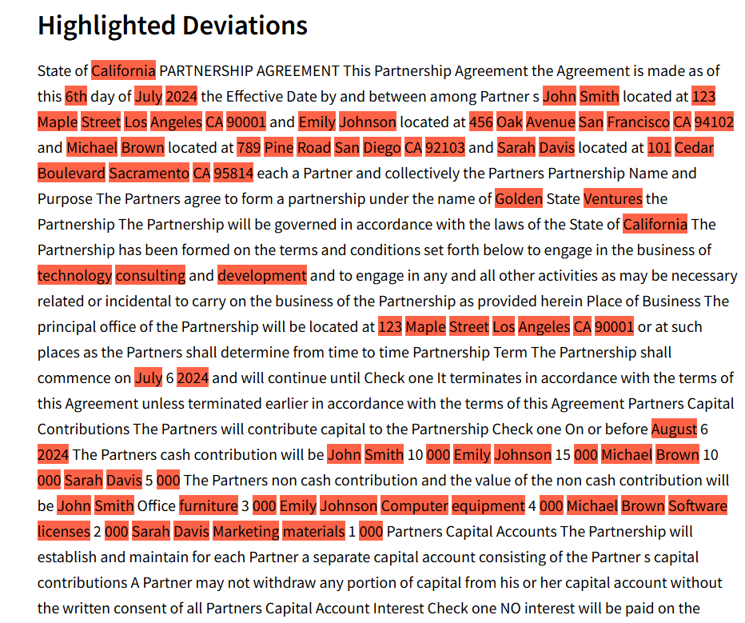
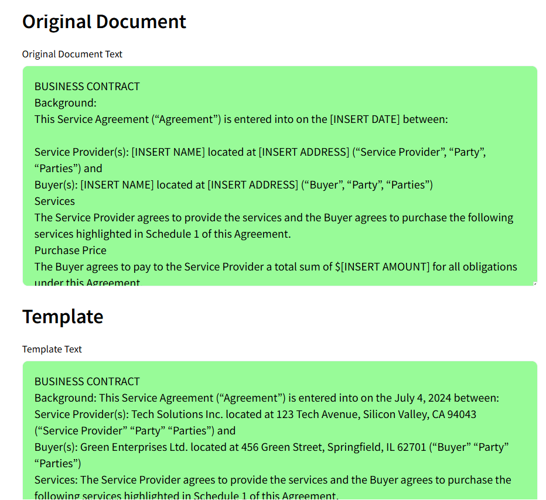

# Business Contract Validation

Welcome to the *Business Contract Validation* app, a powerful tool designed to help users classify contract content into specific clauses, identify deviations from templates, and highlight those differences. This app is built using Streamlit, leveraging the power of PyMuPDF for PDF processing and python-docx for DOCX processing, making it user-friendly and highly efficient.

## Objectives

The primary objective of this project is to provide a streamlined way to validate business contracts by:

1. Extracting and classifying clauses from contract documents.
2. Comparing the contract against a predefined template.
3. Highlighting any deviations between the contract and the template.


## Uniqueness

1. *User-Friendly Interface*: Simplified navigation with clear instructions and intuitive design.
2. *Comprehensive Text Handling*: Supports multiple document formats (TXT, DOCX, PDF).
3. *Real-time Highlighting*: Instantly highlight differences between the contract and the template.
4. *Custom Styling*: Consistent and aesthetically pleasing UI with custom CSS for better user experience.

## Deliverables

1. *Document Upload Interface*: Allow users to upload contract and template documents in various formats (TXT, DOCX, PDF).
2. *Text Extraction*: Efficiently read and extract text from the uploaded documents.
3. *Text Comparison*: Highlight deviations between the contract and the template.
4. *Clause Extraction*: Extract and display specific clauses from the contract document.

## Implementation Steps

1. **Installation:**
   - Clone the repository:
     ```
     git clone https://github.com/gopiikaaa/Business-contract-validation.git
     cd business-contract-validation
     ```
   - Install dependencies:
     ```
     pip install -r requirements.txt
     ```
   
2. **Running the Application:**
   - Run the Streamlit application:
     ```
     streamlit run app.py
     ```
   
3. **Usage:**
   - Upload a contract document and a corresponding template.
   - Navigate between "Home", "Highlighted Deviations", and "Extracted Clauses" using the top menu buttons.
   - View highlighted deviations between the contract and template, and extracted clauses from the contract.

## User Interface

### Navigation

- *Home*: Upload your contract and template documents.

- *Highlighted Deviations*: View the original document, template, and highlighted deviations.

- *Extracted Clauses*: View specific clauses extracted from the contract.

### Custom CSS

- White background for the app with black font color.
- Top menu for easy navigation.
- Custom styles for buttons and file uploaders to enhance the visual appeal and usability.

## Conclusion

The Business Contract Validation app is a robust and user-friendly solution for validating business contracts. By providing tools to classify content, identify deviations, and highlight differences, it significantly simplifies the contract validation process.

## Team Members

- [Gopika M Panicker](https://github.com/gopiikaaa)
- [Jumana Jouhar](https://github.com/jumanajouhar)
- [Parvathy S](https://github.com/ParvathyS1103)
- [Aiswarya Arun](https://github.com/AiswaryaArun19)
- [Bhagya Suresh Kumar](https://github.com/bhagya005)

